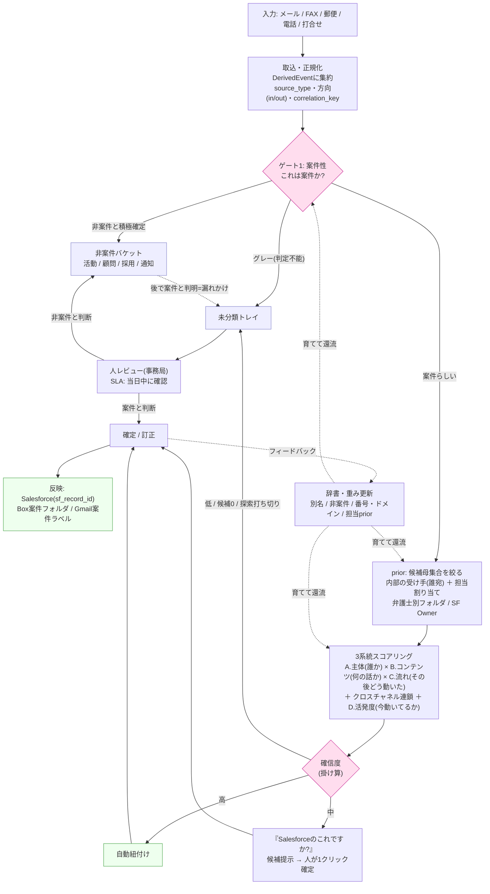

# 紐付け設計マップ（1枚俯瞰）― ゲート→prior→3系統→確信度→未分類/フィードバック

- 作成日: 2026-06-05
- 用途: 久保さんへの設計材料。これまでの4資料（02〜04）を**1本のパイプライン**として俯瞰する。
- 読み方: 上から下へ1件のデータ（メール/FAX/郵便/電話/打合せ）が流れる。各ブロック末尾の `→ §xx` が詳細資料の参照先。

---

## 1. 全体フロー図

---

## 2. 各ステップの要点（資料への入口）

| # | ステップ | 一言 | 詳細 |
|---|---|---|---|
| 0 | **取込・正規化** | 全チャネルを背骨(DerivedEvent)に集約。source_type・方向・相関キーを付与 | §03-3, §03-5(クロスチャネル) |
| 1 | **ゲート1: 案件性** | まず「案件か非案件か」。**非案件を先に外して過剰探索を止める** | §04-3, §04-4 |
| — | 非案件バケット | 捨てずに行き先(活動/顧問/採用/通知)を持つ＝事後回収の保険 | §04-5 |
| 2 | **prior: 候補を絞る** | 「うちの誰宛か」「誰がどの案件か」で母集合を縮小してから評価 | §03-5-E |
| 3 | **3系統スコアリング** | 主体×コンテンツ×流れ＋活発度。系統をまたぐほど確信度↑ | §03-5, §02 |
| 4 | **確信度(掛け算)** | 高=自動 / 中=「これですか?」/ 低=未分類。**打ち切り条件**で延々探さない | §02-4, §04-6 |
| 5 | **未分類トレイ** | 判定不能・低確信は捨てずに人へ。**漏れの最後の砦**(SLA付き) | §04-2, §04-6 |
| 6 | **反映** | 確定を sf_record_id/Box/Gmailラベルに書き戻し | §01, §02-0 |
| 7 | **フィードバック** | 人の確定で辞書・重みを育て、全ゲートに還流。グレーが減っていく | §03-5-7, §04-7 |

---

## 3. この1枚が体現している設計思想（4点）

1. **2ゲート構造** ― 「案件か(ゲート1)」を「どの案件か(ゲート4)」の前に置く。非案件を先に外すのが**過剰探索を止める**鍵。 → §04
2. **絞ってから上げる** ― 内部の受け手/担当(prior)で**候補を絞り**、3系統で**確信度を上げる**。順序が手戻りを減らす。 → §03-5-E
3. **疑わしきは捨てない／でも延々探さない** ― 漏れ＞過剰の非対称性。低確信・グレーは**未分類トレイ(必ず人が見る)**へ、探索は**打ち切り条件**で止める。 → §04-2
4. **育つ仕組み** ― 人の確定をフィードバックして辞書・重みを更新。**使うほど自動化率が上がる**。郵便・相談→受任ペアなどクリーンなデータを教師の起点に。 → §03-5-7

---

## 4. 監視（うまく回っているかを数字で言う）

- **紐付け漏れ率**（後から案件と判明した未分類・非案件の割合）― 最重要、下げる
- **過剰探索率**（非案件に費やした探索コスト）― 下げる
- **未分類滞留時間**（SLA内か）
- **自動紐付け率 / 非案件早期確定率**（辞書の成熟とともに上がる）

→ 詳細は §04-8。
